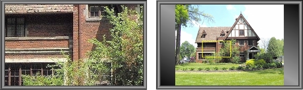



## MorphPicViewer v1\.01 \- Large Image Navigation Usercontrol

### Description

(24 Mar 2007 - Added .ColorAtCursor property) I've seen a lot of projects on PSC for scrolling large images and with the exception of Carles P.V.'s excellent submission at txtCodeId=30414, they all seem to involve slapping a couple of scrollbars on a VB PictureBox. Navigating large images by fumbling with scrollbars is very awkward, for me anyway. So just for fun (I have no use for this) I cooked up this little beastie. Its ClickNavigation feature provides

a much faster [is 'instantly' fast enough for you? ;)], more natural way to navigate large images than anything I've seen so far on PSC.

Features include:

- Image display in either Normal or Stretched (display-to-fit) modes. - Aspect ratio may be optionally maintained in Stretched viewing mode.

- Two image navigation modes are available for viewing large images - ClickNavigation and DragNavigation. ClickNavigation is a unique

feature that displays entire image when the Ctrl key is held down, maintaining aspect ratio if mandated by the .KeepAspectRatio property. A rectangle outlines the portion of the image that's currently being displayed in Normal mode. Clicking on the image moves the rectangle, and when Normal view is reestablished by releasing Ctrl, the view is changed to the new coordinates. DragNavigation (which Carles features in his submission also) allows user to simply drag the image around in Normal mode until the desired area is in view. - Any portion of image can also be displayed via code using the .DisplayImage method, supplying the X and Y coordinates of the upper left hand corner of the image portion you wish to display. - Control can be used as a simple PictureBox replacement; image navigation can be disabled for straightforward image display (although image stretching and aspect ratio features are always available). Control is also a container as is the standard VB PictureBox. As always,

constructive feedback is always welcome, and votes are always appreciated.
 
### More Info
 

             |
---                |---
**Submitted On**   |2007-03-24 09:17:58
**By**             |[Option Explicit](https://github.com/Planet-Source-Code/PSCIndex/blob/master/ByAuthor/option-explicit.md)
**Level**          |Intermediate
**User Rating**    |5.0 (70 globes from 14 users)
**Compatibility**  |VB 6\.0
**Category**       |[Custom Controls/ Forms/  Menus](https://github.com/Planet-Source-Code/PSCIndex/blob/master/ByCategory/custom-controls-forms-menus__1-4.md)
**World**          |[Visual Basic](https://github.com/Planet-Source-Code/PSCIndex/blob/master/ByWorld/visual-basic.md)
**Archive File**   |[MorphPicVi2055863242007\.zip](https://github.com/Planet-Source-Code/option-explicit-morphpicviewer-v1-01-large-image-navigation-usercontrol__1-68042/archive/master.zip)

